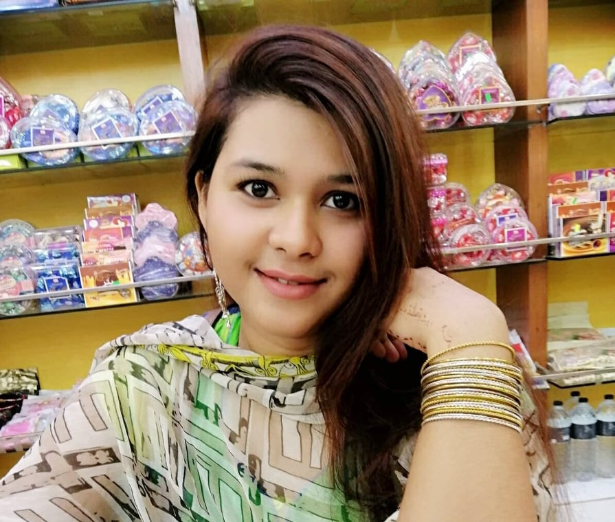

<html>
    <title>Amatullah Alive</title>
    
<body>
    

                
                
<b> Amatullah Alive </b> 

                  United International University,CSE 

            

    

            <h2 align="left"><b>Education:</b></h2>
                <table align="center" width="60%" border="1">
              <tr>
                  <th>Dgree</th>
                  <th>Instritution</th>
                  <th>Year</th>
                  <th>GPA</th>
              </tr>
               <tr>
                  <th>SSC</th>
                  <th>Viqarunnusa Noon School and College</th>
                  <th>2016</th>
                  <th>5.00</th>
              </tr>      
              <tr>
                  <th>HSC</th>
                  <th>Viqarunnusa Noon School and College</th>
                  <th>2018</th>
                  <th>4.58</th>
              </tr>
            </table>
    

        

    <ul>
            <h2 align="left">Hobby:</h2>
        <li align="left">Listening Music</li>
        <li align="left">Traveling</li>
        <li align="left">Gaming</li>
        <li align="left">Progaming</li>
        <li align="left">Photography</li>
    </ul>
        
    
    

    <table width="100%" border="0">
        <tr>
             <th>
            <h2 align="left">Work Experience:</h2>
    <ul>
        <li align="left">Organizer</li>
        <li align="left">Volunteer</li>
    </ul>
            </th>
        </tr>
    </table>
        

   

        
            <h2 align="left">Awards:</h2>
    <ul>
        <li align="left">Best Captain</li>
        <li align="left">2nd position in Essay Writing </li>
        <li align="left">Anual sports rewards</li>
    </ul>
    

    

            <h2 align="left">Extra curriculum skills:</h2>
    <ul>
        <li align="left">Cyceling</li>
        <li align="left">Table Tennis</li>
        <li align="left">Badminton</li>
    </ul>
    

    

            <h2 align="left">Memorable Day:</h2>
        <h4>My Most Memorable Event I remember my brother and cousins playing swimming, dancing, dancing and hiding. Once food is ready, we gather to say prey and feast. After the meal, everyone went to the movie theater to eat family time. I saw Tyler Perry's movie "Madea's Family Reunion". That movie reminds me of my family. I informed that my family is all, my family is not perfect. Either way, we need to learn to pass good times and bad things. My most memorable event In my life, I experienced countless unforgettable events. The unforgettable moment of my life is different from the best thing in my life, and sometimes worse. Either way, these memories have become milestones I always remember, this is the day I got Golden A+ in SSC examination . I enjoyed a lot.So, this day is the most memorable one.</h4>

<h2 align="left">Contact Information:</h2>
<h4 align="center">Mailing Address:67,5/C Mayakanon,shobujbag,Dhaka</h4>
<h4 align="center">Email :aalive193077@bscse.uiu.ac.bd</h4>
<h4 align="center">Mobile No.:01558142084</h4>

</body>
</html>
